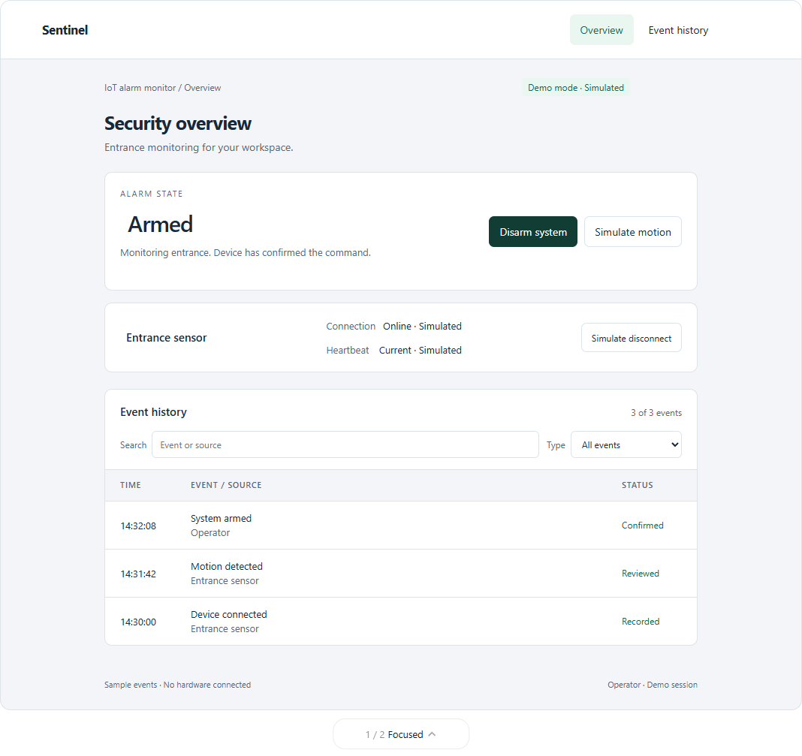

# IoT Motion Security System

A Flask project exploring Arduino-based motion monitoring, account access, alarm controls, and event history.

**Status:** the existing application is a legacy prototype. The redesign below is an interactive UI proposal with simulated events; backend and hardware integration work remains to be completed.

## Proposed dashboard

The proposed **Focused** layout gives the single-device workflow a clear interface. A second **Console** layout is included for comparison.

Download or clone this repository and open [`docs/ui-concept.html`](docs/ui-concept.html) in a browser. GitHub's file viewer displays the source, not the interactive page. The preview requires no server, database, or hardware.

Try simulated motion, alert acknowledgement, arm/disarm confirmation, device disconnection/reconnection, event search, and type filtering. All data is simulated and controls do not operate real equipment.

## Existing code

- `IoT.py`: Flask routes, login/admin access, database-backed event logging, and alarm-control requests.
- `arudino.py`: standalone serial reader that currently prints received data.
- `config.py` and `.env.example`: local database, serial, and session configuration.
- `templates/` and `static/`: the current application UI.

The current Flask application expects a local Microsoft Access database and ODBC driver. Its database schema, dependency manifest, and Arduino firmware are not yet supplied, so it does not currently have a reproducible fresh-clone setup. The prototype page above runs independently of that application.

## Prototype scope

The dashboard demonstrates the proposed interaction design. It does not replace the current Flask templates, send serial commands, or establish a live hardware connection. Integrating this interface into the application is the next implementation step.
