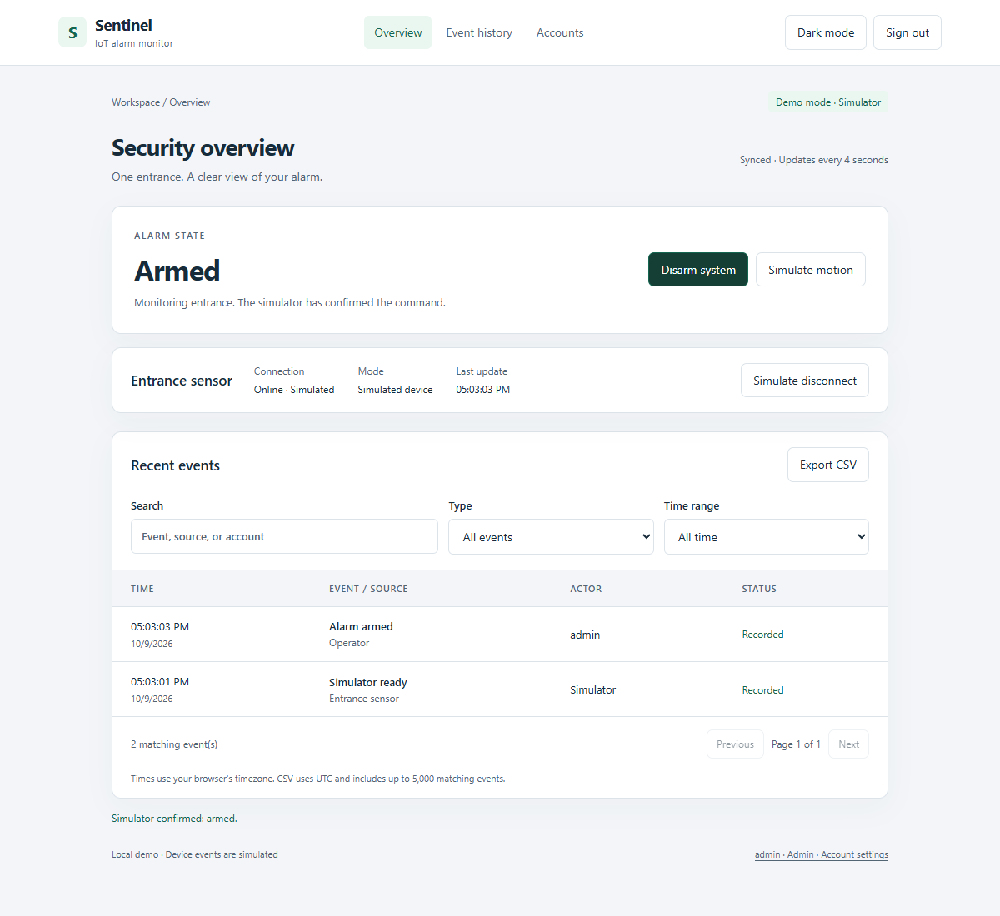

# Sentinel · IoT alarm monitor

A working Flask and SQLite demo for monitoring a single entrance: arm the alarm, simulate motion, acknowledge alerts, and review saved event history.



## Run locally

Requires Python 3.10 or newer. No Access driver, database download, Arduino, or manually configured session key is required.

**Windows:** double-click `start.cmd` to create a virtual environment, install dependencies, and start the app. Keep its terminal window open.

Or run these commands from the repository folder in PowerShell:

```powershell
python3 -m venv .venv
.\.venv\Scripts\python.exe -m pip install -r requirements.txt
.\.venv\Scripts\python.exe .\IoT.py
```

**macOS / Linux:**

```bash
python3 -m venv .venv
.venv/bin/python -m pip install -r requirements.txt
.venv/bin/python IoT.py
```

Open [http://127.0.0.1:5000](http://127.0.0.1:5000). Press Ctrl+C in the terminal to stop.

The first launch creates the SQLite schema, demo accounts, and a random persistent signing key inside the gitignored `instance/` folder. Alarm state, accounts, and events survive refresh and restart.

## Demo accounts

| Role | Username | Password |
|---|---|---|
| Admin | admin | DemoAdmin!2026 |
| Operator | operator | DemoUser!2026 |

These accounts are seeded only into an empty database. Both can monitor and control the simulated device. Only admins can create, enable, or disable accounts. Each account can change its password.

## Try the workflow

1. Sign in and click **Arm system**.
2. Click **Simulate motion**: the state becomes **Triggered**, with an event awaiting review.
3. **Acknowledge alerts**: the alarm stays armed and the event is marked reviewed.
4. **Disarm system**, then confirm: motion is still recorded without triggering an alarm.
5. **Simulate disconnect**: the state becomes **Unknown** and device controls are blocked. Reconnect to recover the saved state.
6. Search and filter events, page through history, or export matching records to CSV.
7. Refresh the page or restart the app to verify persistence.

## Implemented

- Responsive Focused dashboard, login, event history, account management, and light/dark appearance.
- Persistent alarm state separate from logs; explicit offline state and pending/error feedback.
- Revision checks prevent a stale browser session from overwriting another user's newer device state.
- Search, type and time filters, pagination, UTC storage with local display, and CSV export (up to 5,000 matching events).
- Password hashing, CSRF protection, login throttling, session expiry, and server-side role enforcement.
- Account disabling and password changes revoke existing sessions. Event history is preserved.
- Database initialization, optional environment settings, tests, and a GitHub Actions template.

All accounts in this local demo share one workspace and one simulated device. Events record the acting account. Acknowledgement records who reviewed alerts; normal users cannot delete history.

## Configuration

The app runs without `.env`. Copy `.env.example` to `.env` only to override defaults:

| Setting | Default / purpose |
|---|---|
| SQLITE_DATABASE | instance/sentinel.sqlite3; relative paths resolve from the repository |
| SECRET_KEY | Generated and persisted automatically; custom values must be random and at least 32 characters |
| SEED_DEMO | true; seeds the two demo accounts only when no accounts exist |
| SECURE_COOKIES | false for local HTTP; enable only behind HTTPS |

To start with your own accounts, set `SEED_DEMO=false` before the first run and create an admin:

```powershell
.\.venv\Scripts\python.exe -m flask --app IoT create-admin yourname
```

The command prompts for a password. Setting `SEED_DEMO=false` does not remove previously created accounts; use account management to disable them or change their passwords.

## Tests

```powershell
.\.venv\Scripts\python.exe -m pip install -r requirements-dev.txt
.\.venv\Scripts\python.exe -m pytest -q
.\.venv\Scripts\python.exe -m ruff check .
```

The suite covers first-run setup, password hashes, CSRF, authentication and admin permissions, account/session revocation, state persistence, offline controls, stale commands, malformed inputs, acknowledgement, event filters/pagination, CSV safety, and login throttling.

An optional [GitHub Actions template](docs/checks.yml) is included. Copy it to `.github/workflows/checks.yml` to run the Python checks on pushes and pull requests. Adding workflow files with a GitHub CLI OAuth token may require its `workflow` permission; the minimum app itself does not require that permission.

## Structure

- `IoT.py`: entry point, preserving the original launch command.
- `sentinel/`: application factory, database schema/helpers, authenticated routes, and simulator transactions.
- `templates/` and `static/`: the actual application interface, served by Flask.
- `tests/`: backend regression tests.
- `docs/ui-concept.html`: the earlier standalone design prototype, retained for reference.

## Scope

This release is a **local software demo with a simulated device**. It does not send commands to physical hardware or ingest real PIR readings. The legacy `arudino.py` reader is separate from the web app; a live serial protocol, firmware, wiring details, and hardware verification remain future work.

Existing Access files are neither opened nor migrated. Their records are not automatically imported into the new SQLite database. The incomplete PIN and log-deletion flows have been removed.

The bundled launcher binds to localhost with debugging disabled. Public hosting, multiple workspaces, notifications, camera feeds, and production hardening are outside this minimum release. Keep the default demo credentials confined to the local demonstration.
